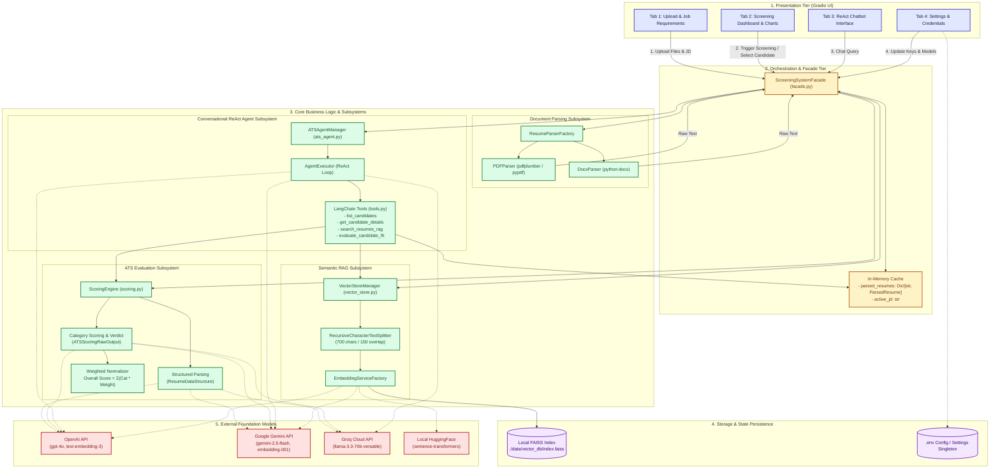
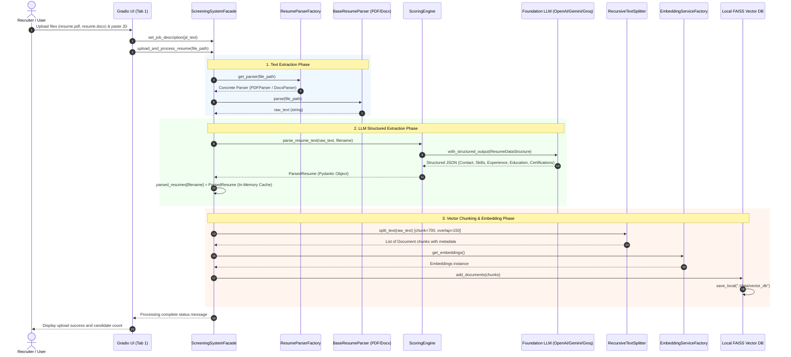
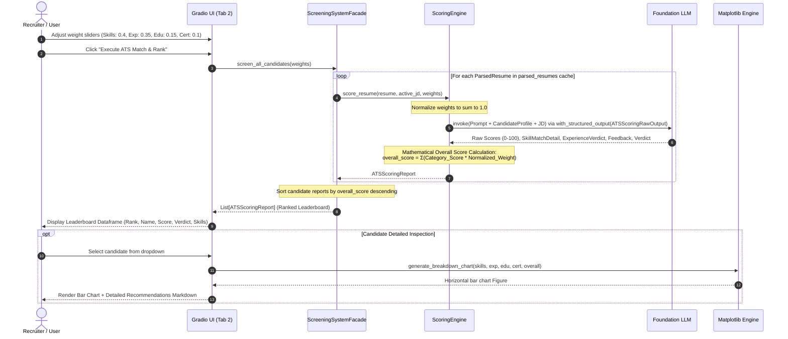
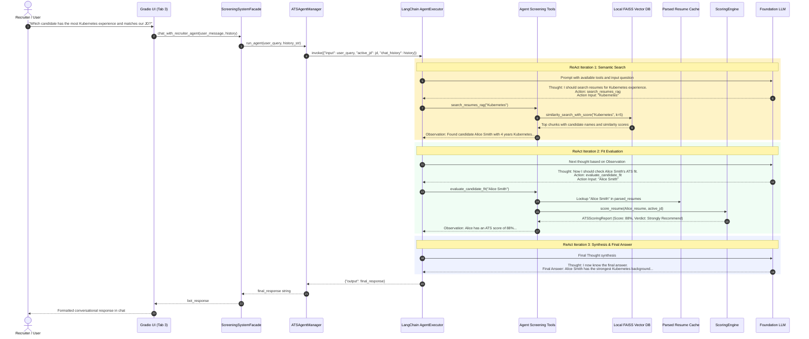
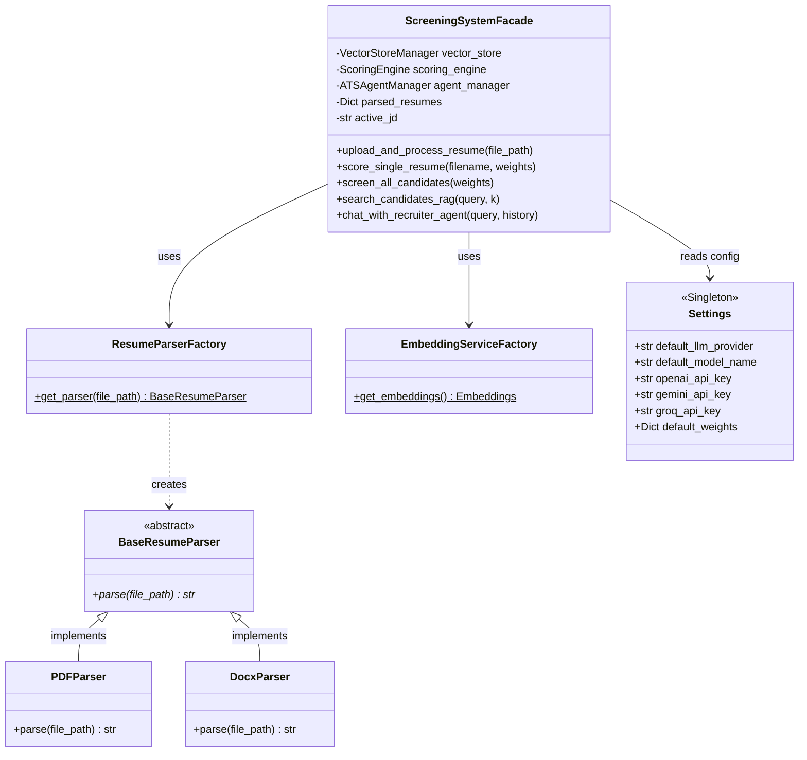

# System Architecture & Data Flow Specification
## Resume Screening & ATS Scoring Platform

This document provides a comprehensive technical breakdown of the platform's architectural topology, design patterns, subsystem relationships, and end-to-end data flows.

---

## 1. High-Level System Architecture Diagram

The system is structured as a multi-tier, decoupled architecture adhering to clean software engineering principles. The **Gradio UI** interacts solely with the **Screening System Facade**, which orchestrates parsing, scoring, vector search, and agentic workflows.

---

## 2. End-to-End Data Flow Diagrams

### Data Flow 1: Resume Ingestion, Structured Extraction & Vector Indexing

This sequence illustrates what happens when a recruiter uploads resumes (`.pdf` or `.docx`) and inputs a Job Description in **Tab 1**.

---

### Data Flow 2: ATS Evaluation, Category Breakdown & Leaderboard Generation

This sequence details how candidate resumes are scored against the active Job Description, how category weights are applied, and how visual charts are rendered in **Tab 2**.

---

### Data Flow 3: Conversational ReAct Recruiter Agent

This sequence illustrates the agentic loop when a recruiter interacts with the conversational recruiter assistant in **Tab 3**.

---

## 3. Detailed Component Map & Responsibilities

| Subsystem / Component | File Location | Key Classes / Functions | Primary Responsibility |
| :--- | :--- | :--- | :--- |
| **Facade Orchestrator** | `resume_ats_agent/facade.py` | `ScreeningSystemFacade` | Unified system API, lifecycle management, in-memory state coordination (`parsed_resumes`, `active_jd`). |
| **Parsing Strategy** | `resume_ats_agent/parsers/` | `BaseResumeParser`, `PDFParser`, `DocxParser` | Strategy Pattern. Robust text extraction across multi-format resumes with table and column preservation. |
| **Parser Factory** | `resume_ats_agent/parsers/factory.py` | `ResumeParserFactory` | Factory Pattern. Dynamic parser resolution based on file extension (`.pdf`, `.docx`). |
| **Scoring Engine** | `resume_ats_agent/engine/scoring.py` | `ScoringEngine`, `ResumeDataStructure`, `ATSScoringRawOutput` | LLM-based structured information extraction, weighted matching logic, score normalization, Pydantic report generation. |
| **Vector Store Manager** | `resume_ats_agent/rag/vector_store.py` | `VectorStoreManager` | Text chunking (`700`/`150`), local FAISS database persistence, deserialization, and L2 similarity search. |
| **Embedding Factory** | `resume_ats_agent/rag/embedding_service.py` | `EmbeddingServiceFactory` | Instantiates HuggingFace local models, OpenAI embeddings, or Gemini embeddings dynamically. |
| **ReAct Agent Manager** | `resume_ats_agent/agents/ats_agent.py` | `ATSAgentManager` | LangChain ReAct agent compilation, chain-of-thought prompt orchestration, and execution error recovery. |
| **Agent Screening Tools** | `resume_ats_agent/agents/tools.py` | `create_screening_tools` | Custom LangChain tools (`list_candidates`, `get_candidate_details`, `search_resumes_rag`, `evaluate_candidate_fit`). |
| **Data Models & Schemas** | `resume_ats_agent/models/schemas.py` | `ParsedResume`, `ContactInfo`, `WorkExperience`, `Education`, `ATSScoringReport`, `ATSScoreBreakdown`, `SkillMatchDetail` | Strict type validation, serialization, and standardized domain schema definitions. |
| **Configuration Singleton** | `resume_ats_agent/config/settings.py` | `Settings`, `settings` | Singleton Pattern. Global thread-safe configurations, API key updates, and environment persistence. |
| **Presentation Tier** | `resume_ats_agent/ui/app.py` | `create_gradio_app`, `generate_breakdown_chart` | Interactive web UI with 4 functional tabs, Matplotlib horizontal breakdown chart, and reactive callbacks. |

---

## 4. Software Design Patterns Implemented

1. **Facade Pattern (`ScreeningSystemFacade`)**: Encapsulates the entire complex multi-component subsystem (parsers, vector stores, scoring engine, agent executor) behind a clean, single-point API used by the UI.
2. **Strategy Pattern (`BaseResumeParser`, `PDFParser`, `DocxParser`)**: Abstracts file parsing algorithms into interchangeable strategies selected at runtime based on file format.
3. **Factory Pattern (`ResumeParserFactory`, `EmbeddingServiceFactory`)**: Decouples client code from class instantiation, allowing dynamic selection of parser algorithms and embedding backends.
4. **Singleton Pattern (`Settings`)**: Enforces a single global configuration instance across threads, ensuring runtime UI settings changes take effect immediately across all subsystems.
